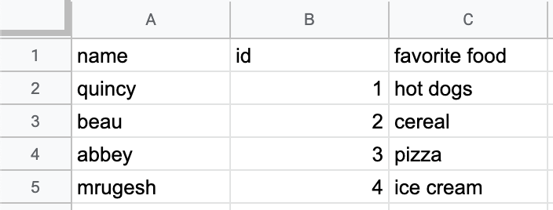

# Parse CSV Data

A common interview problem is taking raw CSV data , and modeling it into an object.

## CSV File Format

Usually the first line in a CSV file contains the table column labels. Each of the subsequent lines represent a row of the table. Commas separate each cell in the row, which is where the name comes from.

Here is an example of a CSV file. The example has three columns, labeled 'name', 'id', and 'food'. It has five rows including the header row.

```
name, id, favorite food
quincy, 1, hot dogs
beau, 2, cereal
abbey, 3, pizza
mrugesh, 4, ice cream
```

Here is how that file looks in a spreadsheet.



In this project you will parse the CSV data into a Team object and place them into an ArrayList.


```
Team,Games,Wins,Losses,Draws,Goals,Goals Allowed,Points
Arsenal,38,26,9,3,79,36,87
Liverpool,38,24,8,6,67,30,80
Manchester United,38,24,5,9,87,45,77
Newcastle,38,21,8,9,74,52,71
Leeds,38,18,12,8,53,37,66
Chelsea,38,17,13,8,66,38,64
West_Ham,38,15,8,15,48,57,53
Aston_Villa,38,12,14,12,46,47,50
Tottenham,38,14,8,16,49,53,50
Blackburn,38,12,10,16,55,51,46
Southampton,38,12,9,17,46,54,45
Middlesbrough,38,12,9,17,35,47,45
Fulham,38,10,14,14,36,44,44
Charlton,38,10,14,14,38,49,44
Everton,38,11,10,17,45,57,43
Bolton,38,9,13,16,44,62,40
Sunderland,38,10,10,18,29,51,40
Ipswich,38,9,9,20,41,64,36
Derby,38,8,6,24,33,63,30
Leicester,38,5,13,20,30,64,28
```